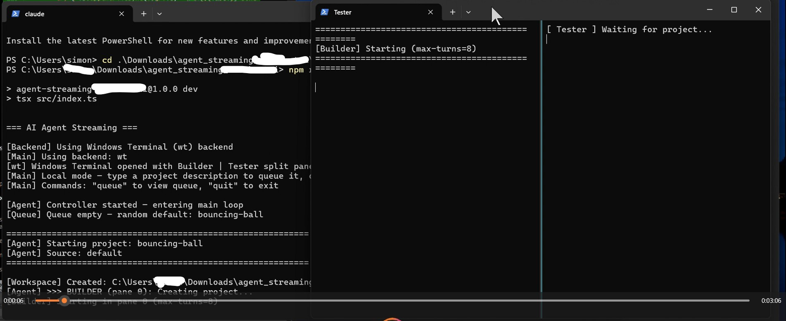
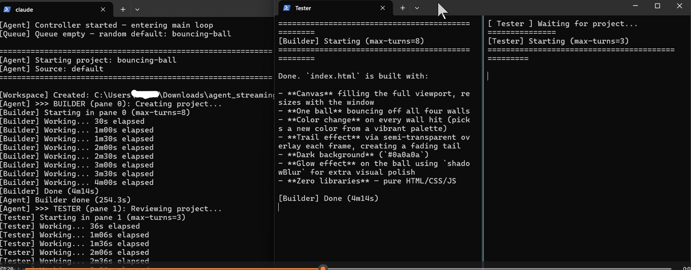
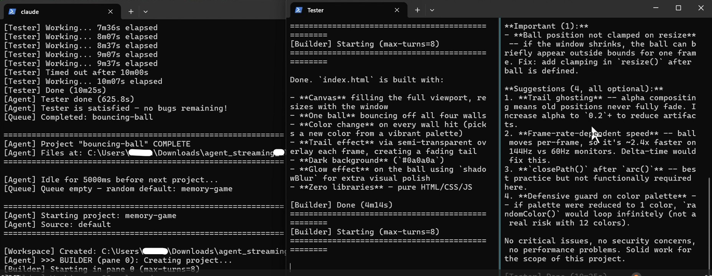

# AI Agent Streaming

An AI agent system that uses Claude Code CLI to build software projects autonomously. Two Claude instances — a **Builder** and a **Tester** — take turns creating and reviewing code in a visible split-terminal setup, mimicking the real-time Twitch streaming in the YouTube video ["Claude Code AI Agent Controls Claude Code On Twitch"](https://www.youtube.com/watch?v=rtTuXAvS2yw). Twitch chat integration and streaming support are built-in but have not been tested.





## Table of Contents

- [How It Works](#how-it-works)
- [The Builder-Tester Ping-Pong](#the-builder-tester-ping-pong)
- [Worked Example: bouncing-ball](#worked-example-bouncing-ball)
- [Terminal Backends](#terminal-backends)
- [Turns Explained](#turns-explained)
- [Timeouts Explained](#timeouts-explained)
- [Configuration Reference](#configuration-reference)
- [Setup Instructions](#setup-instructions)
- [Project Structure](#project-structure)

---

## How It Works

The system runs an infinite loop. Each iteration:

1. Picks a project from the queue (or a random default)
2. Creates a workspace directory
3. Runs the **Builder** (Claude instance 1) to write the code
4. Runs the **Tester** (Claude instance 2) to review the code and find bugs
5. If bugs are found, loops: Builder fixes → Tester re-checks (up to `MAX_ITERATIONS` rounds)
6. Marks the project complete, pauses briefly, then starts the next one

The entire cycle is visible in split terminal panes so viewers can watch both agents work in real time.

---

## The Builder-Tester Ping-Pong

The Builder and Tester coordinate through a shared `NOTES.md` file in the project workspace. The flow is **sequential**, not parallel — each agent takes its turn while the other is idle.

### Step 1: Builder Creates the Project (Pane 0)

The Builder receives a prompt like:

```
Build "bouncing-ball". Build an index.html: one ball bouncing around the screen
using canvas. Ball changes color each time it hits a wall. Trail effect behind
the ball. Dark background. No libraries. When done, append "BUILD COMPLETE" to NOTES.md.
```

The Builder writes code files (typically a single `index.html`) and appends `"BUILD COMPLETE"` to `NOTES.md` when finished.

### Step 2: Tester Reviews the Code (Pane 1)

Once the Builder exits, the Tester receives:

```
Review "bouncing-ball". Read index.html. Find 2-3 bugs or missing features.
Write them to NOTES.md under "## Bugs Found" as a short list. Do NOT edit code files.
```

The Tester reads the code, identifies issues, and writes them to `NOTES.md` under a `## Bugs Found` section. The Tester is **read-only** — it never modifies code files.

### Step 3: Fix-Retest Loop (up to MAX_ITERATIONS rounds)

The agent controller reads `NOTES.md` and checks for termination conditions:

- If `NOTES.md` contains `"ALL FIXES VERIFIED"` or `"NO CHANGES NEEDED"` → **done**, skip remaining iterations
- If `NOTES.md` does not contain a `"## Bugs Found"` section → **done**
- Otherwise → run another fix-retest cycle

**Builder fixes (Pane 0):**
```
Fix the bugs listed in NOTES.md for "bouncing-ball". After fixing,
append "ITERATION 1 FIXES APPLIED" to NOTES.md.
```

**Tester re-checks (Pane 1):**
```
Re-check "bouncing-ball". Read index.html and NOTES.md. If bugs remain,
update "## Bugs Found" in NOTES.md. If all fixed, write "ALL FIXES VERIFIED"
in NOTES.md. Do NOT edit code files.
```

This loop runs up to `MAX_ITERATIONS` times (default: 3).

### Coordination Flow Diagram

```
Agent Controller
    │
    ├─── Create workspace (projects/<name>-<timestamp>/)
    │    └─── Write initial NOTES.md with project description
    │
    ├─── [Pane 0] Builder: build project
    │    └─── Writes code + appends "BUILD COMPLETE" to NOTES.md
    │
    ├─── [Pane 1] Tester: review code
    │    └─── Writes "## Bugs Found" to NOTES.md (or "NO CHANGES NEEDED")
    │
    ├─── Loop (up to MAX_ITERATIONS):
    │    │
    │    ├─── Read NOTES.md → check termination conditions
    │    │    ├─── "ALL FIXES VERIFIED" → break
    │    │    ├─── "NO CHANGES NEEDED" → break
    │    │    └─── No "## Bugs Found" → break
    │    │
    │    ├─── [Pane 0] Builder: fix bugs from NOTES.md
    │    │    └─── Appends "ITERATION N FIXES APPLIED"
    │    │
    │    └─── [Pane 1] Tester: verify fixes
    │         └─── Updates "## Bugs Found" or writes "ALL FIXES VERIFIED"
    │
    └─── Mark project complete → idle → next project
```

---

## Worked Example: bouncing-ball

Here is a concrete trace of one project cycle using the `bouncing-ball` default project:

**1. Project selected:**
```
[Queue] Queue empty — random default: bouncing-ball
[Agent] Starting project: bouncing-ball
[Agent] Source: default
```

**2. Workspace created at** `projects/bouncing-ball-1772401263567/`:
```
NOTES.md          ← initial project description + coordination protocol
```

**3. Builder runs** (Pane 0, max 8 turns):
```
[Agent] >>> BUILDER (pane 0): Creating project...
[Builder] Starting in pane 0 (max-turns=8)
[Builder] Working... 30s elapsed
[Builder] Working... 1m00s elapsed
...
[Builder] Done (4m14s)
[Agent] Builder done (254.3s)
```
After the Builder finishes, the workspace contains:
```
index.html        ← the built project
NOTES.md          ← now includes "BUILD COMPLETE"
```

**4. Tester runs** (Pane 1, max 3 turns):
```
[Agent] >>> TESTER (pane 1): Reviewing project...
[Tester] Starting in pane 1 (max-turns=3)
[Tester] Working... 36s elapsed
...
[Tester] Done (2m10s)
```
`NOTES.md` now contains:
```markdown
## Bugs Found
- Ball doesn't change color on wall collision
- No trail effect implemented
```

**5. Fix iteration 1** — Builder fixes bugs (Pane 0):
```
[Agent] >>> BUILDER (pane 0): Fixing bugs (iteration 1/3)...
```
`NOTES.md` gets: `"ITERATION 1 FIXES APPLIED"`

**6. Retest iteration 1** — Tester verifies (Pane 1):
```
[Agent] >>> TESTER (pane 1): Verifying fixes (iteration 1/3)...
```
If all bugs are fixed, Tester writes `"ALL FIXES VERIFIED"` → loop breaks.
If bugs remain, Tester updates `"## Bugs Found"` → loop continues to iteration 2.

**7. Project complete:**
```
[Agent] Project "bouncing-ball" COMPLETE
[Agent] Files at: projects/bouncing-ball-1772401263567
[Agent] Idle for 5000ms before next project...
```

---

## Terminal Backends

The system supports three terminal backends. The backend determines how Claude processes are spawned and how their output is displayed.

### Backend: `wt` (Windows Terminal) — Recommended for Windows

**Set via:** `TERMINAL_BACKEND=wt` in `.env`

Opens Windows Terminal (`wt.exe`) with two split panes — **Builder** on the left, **Tester** on the right — each tailing a log file in real time.

**How it works:**

1. On `init()`, creates two log files in the projects directory:
   - `pane-builder.log`
   - `pane-tester.log`

2. Spawns `wt.exe` with arguments to open a new tab with a vertical split:
   ```
   wt.exe new-tab --title Builder powershell -NoExit -Command
     "Get-Content -Path 'pane-builder.log' -Wait -Tail 200 -Encoding UTF8"
   ; split-pane -V --title Tester powershell -NoExit -Command
     "Get-Content -Path 'pane-tester.log' -Wait -Tail 200 -Encoding UTF8"
   ```
   The `wt.exe` process is detached (`detached: true, stdio: 'ignore'`) so it doesn't block the main process.

3. On each `runClaude()` call, spawns Claude directly as a child process:
   ```typescript
   spawn(claudePath, ['-p', prompt, '--verbose', '--dangerously-skip-permissions',
     '--max-turns', maxTurns], { cwd: workDir, shell: true })
   ```
   - `cwd: workDir` sets the working directory (no `cd` command needed)
   - `shell: true` ensures Windows can find the `claude` command (which may be a `.cmd` wrapper)
   - `child.stdin.end()` is called immediately to prevent Claude from hanging waiting for stdin input

4. All stdout/stderr from Claude is appended to the pane's log file via `fs.appendFileSync()`. PowerShell's `Get-Content -Wait` picks up new content automatically, creating a live-streaming effect.

5. The log file is reset (`fs.writeFileSync`) at the start of each `runClaude()` call, so each run starts fresh.

**If `wt.exe` is not available** (e.g., Windows Terminal not installed), the init logs fallback instructions:
```
[wt] Open two PowerShell windows manually and run:
  Get-Content 'projects\pane-builder.log' -Wait -Encoding UTF8
  Get-Content 'projects\pane-tester.log' -Wait -Encoding UTF8
```

### Backend: `tmux` — For Linux / macOS / Git Bash with tmux

**Set via:** `TERMINAL_BACKEND=tmux` in `.env`

Creates a tmux session named `agent` with two side-by-side panes. Attach from another terminal with `tmux attach -t agent`.

**How it works:**

1. On `init()`:
   ```bash
   tmux new-session -d -s agent -x 220 -y 50 -c <workDir>
   tmux split-window -h -t agent -c <workDir>
   ```

2. On each `runClaude()`:
   - Writes a bash script to a file with a short name (`cmd-<hex>.sh`) in the workspace
   - Appends a unique sentinel string (`__DONE_<hex>__`) as an `echo` at the end
   - Sends `bash cmd-xxxx.sh` to the pane via `tmux send-keys`
   - Polls `tmux capture-pane` every 3 seconds looking for the sentinel
   - When sentinel is found (or timeout), returns the captured output

3. **Sentinel-based completion detection**: Since tmux `send-keys` is fire-and-forget, there's no built-in way to know when a command finishes. The sentinel pattern solves this:
   ```bash
   claude -p "build a game" --dangerously-skip-permissions < /dev/null
   echo __DONE_a1b2c3d4__
   ```
   The `< /dev/null` is critical on tmux — without it, Claude detects a TTY on stdin and waits for interactive input, causing a hang.

4. **Timeout handling**: On timeout, sends `Ctrl-C` to the pane (`tmux send-keys C-c`) and returns whatever output has been captured so far.

5. All tmux commands run via `spawnSync('bash', ['-c', 'tmux ...'])` to bypass Windows cmd.exe quote mangling.

**Windows-specific notes for tmux:**
- Requires tmux installed in Git Bash (via MSYS2: `pacman -S tmux`)
- Windows paths are converted to MINGW format: `C:\Users\simon` → `/c/Users/simon`
- Script filenames are kept short (~20 chars) to avoid line-wrapping in narrow tmux panes

### Backend: `spawn` — Headless Fallback

**Set via:** `TERMINAL_BACKEND=spawn` in `.env`

Runs Claude as direct child processes with no visual terminal. Output goes to the main console's stdout.

**How it works:**

1. On each `runClaude()`, spawns:
   ```bash
   bash -c "cd '<workDir>' && claude -p '<prompt>' --dangerously-skip-permissions --max-turns <N>"
   ```
2. `child.stdin.end()` is called immediately (same anti-hang pattern)
3. stdout lines are logged with `[Builder]` / `[Tester]` prefix
4. Progress timer logs elapsed time every 30 seconds

This backend works on any platform but provides no split-screen visualization.

### Auto-Detection

If `TERMINAL_BACKEND` is not set in `.env`, the system auto-detects:
1. Check if `tmux -V` succeeds → use tmux
2. Otherwise → use spawn

---

## Turns Explained

A **turn** is one round-trip interaction between Claude and its environment. Each turn, Claude reads the context, decides on an action (write a file, read a file, run a command, etc.), executes it, and observes the result. Multiple turns are needed to complete a task — for example, building a project might take 5-8 turns:

1. Turn 1: Read the prompt, plan the approach
2. Turn 2: Write `index.html` with HTML structure
3. Turn 3: Add CSS styling
4. Turn 4: Add JavaScript logic
5. Turn 5: Read back the file to verify
6. Turn 6: Fix a bug noticed during review
7. Turn 7: Write "BUILD COMPLETE" to NOTES.md
8. Turn 8: (max reached, Claude stops)

### Builder Turns (`MAX_TURNS_BUILDER`, default: 8)

The Builder needs more turns because it writes code from scratch. Each file creation, modification, or shell command consumes a turn. Setting this too low (e.g., 3) means the Builder may not finish writing the code. Setting it too high (e.g., 30) means a confused Builder might loop endlessly burning API credits.

The `--max-turns` flag is passed directly to the Claude CLI:
```
claude -p "<prompt>" --dangerously-skip-permissions --max-turns 8
```

When max turns is reached, Claude outputs `"Reached max turns"` and exits gracefully with code 0.

### Tester Turns (`MAX_TURNS_TESTER`, default: 3)

The Tester needs fewer turns because its job is simpler: read the code, write a bug report. Typical usage:

1. Turn 1: Read `index.html`
2. Turn 2: Read `NOTES.md` for context
3. Turn 3: Write bug findings to `NOTES.md`

Setting this too high risks the Tester doing excessive analysis or running out of context, which slows down the cycle.

### What Happens When Max Turns Is Reached

Claude CLI outputs:
```
Reached max turns (8)
```
The process exits with code 0. The agent controller treats this as a normal completion — whatever the Builder/Tester wrote before hitting the limit is preserved. The cycle continues to the next step.

This is a **soft limit**, not an error. The project may be incomplete, but the Tester will catch missing features in its review.

---

## Timeouts Explained

Every Claude invocation has a timeout — a hard wall-clock limit after which the process is killed.

### Builder/Tester Timeout (default: 10 minutes per invocation)

Set in `agent-controller.ts` as `10 * 60 * 1000` (10 minutes). This is passed through `runClaudeInTerminal()` to the backend's `runClaude()` method.

**What happens on timeout depends on the backend:**

| Backend | Timeout Action | Result |
|---------|---------------|--------|
| `wt` | `child.kill('SIGTERM')`, then `SIGKILL` after 5s | Process killed; `[TIMED OUT]` appended to log file; returns whatever stdout was collected |
| `tmux` | Sends `Ctrl-C` via `tmux send-keys C-c` | Command interrupted; returns whatever `capture-pane` has collected |
| `spawn` | `child.kill('SIGKILL')` | Process killed immediately; returns whatever stdout was collected |

After a timeout, the agent controller proceeds to the next step. If the Builder timed out during initial build, the Tester will still attempt to review whatever was written. If the Tester timed out, the system checks `NOTES.md` for bugs — if no bugs section exists, iteration stops.

### One-Shot Timeout (default: 15 seconds)

Used for the chat analysis function (`runClaudeOneShot`) which parses Twitch chat messages for project requests. This is a lightweight, single-turn Claude call. On timeout, the process is killed with `SIGKILL` and the chat batch is silently dropped.

### Why Timeouts Exist

- **Runaway processes**: Claude might enter a loop (repeatedly reading/writing the same file) or get stuck on a complex task
- **Budget control**: Each Claude invocation consumes API credits; timeouts cap spending per invocation
- **Throughput**: The streaming setup needs to keep moving to new projects; a stuck Builder/Tester would halt everything

---

## Configuration Reference

All configuration is in `.env`:

```env
# ─── Agent Settings ───────────────────────────────────────────
# Path to claude CLI (defaults to "claude" if in PATH)
CLAUDE_PATH=claude

# Builder turns per invocation (default: 8)
MAX_TURNS_BUILDER=8

# Tester turns per invocation (default: 3)
MAX_TURNS_TESTER=3

# Max budget per claude invocation in USD (default: 5)
MAX_BUDGET_USD=5

# Idle timeout between projects in ms (default: 5000)
IDLE_TIMEOUT_MS=5000

# Max build/test/fix iterations per project (default: 3)
MAX_ITERATIONS=3

# Base directory for project workspaces (default: ./projects)
PROJECTS_BASE_DIR=./projects

# Queue file path (default: ./data/queue.json)
QUEUE_FILE=./data/queue.json

# ─── Terminal Backend ─────────────────────────────────────────
# "wt" (Windows Terminal), "tmux", or "spawn" (auto-detected if omitted)
TERMINAL_BACKEND=wt

# ─── Twitch (optional) ───────────────────────────────────────
# TWITCH_CHANNEL=#yourchannel
# TWITCH_OAUTH=oauth:your_token_here
# TWITCH_BOT_USERNAME=your_bot_name

# ─── Streaming (optional) ────────────────────────────────────
# TWITCH_STREAM_KEY=live_xxxxxxxxxxxx
# FFMPEG_PATH=ffmpeg
# OVERLAY_IMAGE=./assets/overlay.png
# MUSIC_PLAYLIST=./assets/playlist.txt
```

---

## Setup Instructions

### Requirements

| Dependency | Required | Notes |
|-----------|----------|-------|
| **Node.js** >= 18 | Yes | Runtime |
| **Claude Code CLI** | Yes | Must be in PATH (`claude --version` to verify) |
| **Windows Terminal** | Recommended | For `wt` backend split panes; pre-installed on Windows 11 |
| **tmux** | Optional | Alternative backend for Linux/macOS/Git Bash |
| **FFmpeg** | Optional | Only for Twitch streaming (`--stream` flag) |

### Installation

```bash
# Clone or download the project
cd agent_streaming_allaboutai

# Install dependencies
npm install

# Copy and edit configuration
cp .env.example .env
# Edit .env — at minimum, verify CLAUDE_PATH is correct
```

### Running

**From PowerShell (recommended on Windows):**
```powershell
npm run dev
```

This will:
1. Load configuration from `.env`
2. Initialize the selected terminal backend (opens Windows Terminal split panes if `wt`)
3. Start the main loop — picks a project and begins the Builder-Tester cycle
4. Print status to the main console

**Local mode**: Type a project description to queue it, or press Enter to let it pick random defaults. Type `queue` to view queue size, `quit` to exit.

**With Twitch chat** (fill in Twitch vars in `.env`):
```bash
npm run dev
```
Chat messages are batched every 10 seconds and analyzed by Claude to detect project requests.

**With Twitch streaming:**
```bash
npm run dev:stream
```
Requires FFmpeg and `TWITCH_STREAM_KEY` in `.env`.

### Verifying the Setup

1. Run `claude --version` — should print Claude Code version
2. Run `npm run dev` from PowerShell
3. Windows Terminal should open with "Builder | Tester" split panes
4. Main console should show `[Agent] Controller started — entering main loop`
5. Builder pane should show output as Claude writes code
6. After Builder finishes, Tester pane should show review output

### Default Projects

When the queue is empty, the system picks a random project from these built-in demos:

| Name | Description |
|------|-------------|
| `color-clock` | Fullscreen digital clock with time-based hex background colors |
| `click-counter` | Centered number that increments on click with CSS animation |
| `bouncing-ball` | Canvas ball that changes color on wall hits with trail effect |
| `typing-test` | Random word typing test with score tracking |
| `gradient-waves` | Animated sine waves on canvas with different colors/speeds |
| `memory-game` | 4x4 card matching game with move counter |

All default projects produce a single `index.html` with no external dependencies.

---

## Project Structure

```
agent_streaming_allaboutai/
├── src/
│   ├── index.ts              # Entry point — wires config, backend, queue, controller
│   ├── types.ts              # TypeScript interfaces (Project, ClaudeResult, etc.)
│   ├── config.ts             # .env loader with validation
│   ├── agent-controller.ts   # Main orchestrator — the build/test/fix loop
│   ├── claude-runner.ts      # High-level Claude invocation (delegates to backend)
│   ├── terminal-backend.ts   # Backend factory + auto-detection
│   ├── wt-controller.ts      # Windows Terminal backend (split panes via log files)
│   ├── tmux-controller.ts    # tmux backend (send-keys + sentinel polling)
│   ├── spawn-controller.ts   # Direct child_process backend (headless)
│   ├── project-queue.ts      # JSON-file backed queue with dedup
│   ├── default-projects.ts   # Built-in demo project definitions
│   ├── prompts.ts            # All Claude prompt templates
│   ├── workspace.ts          # Creates project directories + initial NOTES.md
│   ├── twitch-chat.ts        # tmi.js Twitch IRC client (optional)
│   ├── stream-manager.ts     # FFmpeg process lifecycle (optional)
│   └── ffmpeg-builder.ts     # FFmpeg argument builder for desktop capture
├── data/
│   ├── queue.json            # Runtime project queue (auto-created)
│   └── history.json          # Completed project log (auto-created)
├── projects/                 # Runtime workspace directories (auto-created)
├── .env                      # Configuration (gitignored)
├── package.json
└── tsconfig.json
```

### Key Design Decisions

- **Sequential, not parallel**: Builder and Tester run one at a time. Earlier versions used `Promise.all` for parallel execution, but this was changed because the Tester needs to read the Builder's output.

- **`child.stdin.end()` anti-hang pattern**: Claude CLI detects whether stdin is a TTY. If stdin is a pipe that stays open, Claude may wait for input instead of running the prompt. Calling `stdin.end()` immediately after spawn signals EOF and prevents this hang.

- **Atomic queue writes**: The project queue uses write-to-temp-then-rename (`queue.json.tmp` → `queue.json`) to prevent corruption if the process is killed mid-write.

- **Log file streaming (wt backend)**: Rather than trying to embed Claude's output into a terminal multiplexer, the wt backend writes to plain files and uses PowerShell's `Get-Content -Wait` to tail them. This is simpler and more reliable on Windows than alternatives like node-pty or ConPTY.

- **`--dangerously-skip-permissions`**: All Claude invocations use this flag to bypass the interactive permission prompts that would otherwise require human approval for file writes, shell commands, etc. This is necessary for unattended operation.

---

## Acknowledgements

This project was inspired by the video ["Claude Code AI Agent Controls Claude Code On Twitch"](https://www.youtube.com/watch?v=rtTuXAvS2yw) by AllAboutAI.
